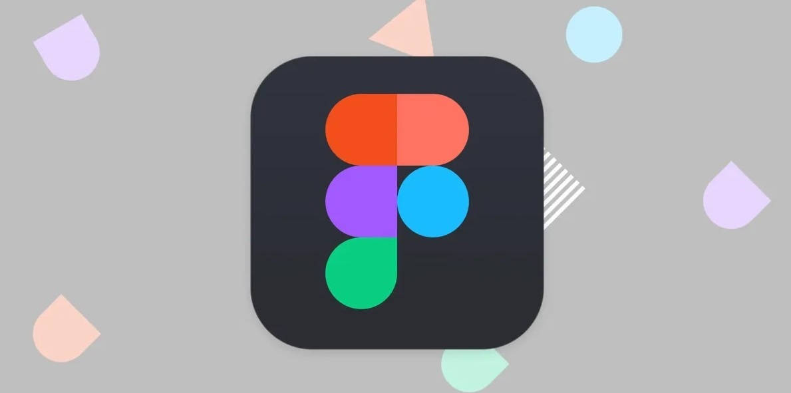

# Software Requirements and Use Cases

## Your Project Title
--------
Prepared by:

* `<McAlister Marshall>`,`<WPI>`
* `<Jake Claybrook>`,`<WPI>`
* `<Vanessa Villalba Simon>`,`<WPI>`
* `<Jace Howhenesian>`,`<WPI>`

---

**Course** : CS 3733 - Software Engineering

**Instructor**: Sakire Arslan Ay

---

## Table of Contents
- [1. Introduction](#1-introduction)
- [2. Requirements Specification](#2-requirements-specification)
  - [2.1 Customer, Users, and Stakeholders](#21-customer-users-and-stakeholders)
  - [2.2 User Stories](#22-user-stories)
  - [2.3 Use Cases](#23-use-cases)
- [3. User Interface](#3-user-interface)
- [4. Product Backlog](#4-product-backlog)
- [4. References](#4-references)
- [Appendix: Grading Rubric](#appendix-grading-rubric)

## Document Revision History

| Name | Date | Changes | Version |
| ------ | ------ | --------- | --------- |
|Revision 1 |2024-11-07 |Initial draft | 1.0        |
|      |      |         |         |
|      |      |         |         |

----
# 1. Introduction

Provide a short description of the software being specified. Describe its purpose, including relevant benefits, objectives, and goals.

This software is used to conect WPI faculty members to students who are looking for undergraduate research. The benefits for this software will increase student interaction between faculty and undergraduates and give students the oppertuity to do research while still in school. The goal of this software is to streamline the discorvery and application process for students to apply for research. This will reduce the time that professors spend looking for students, and make it much easier for students to apply.

----
# 2. Requirements Specification

This section specifies the software product's requirements. Specify all of the software requirements to a level of detail sufficient to enable designers to design a software system to satisfy those requirements, and to enable testers to test that the software system satisfies those requirements.

The software will allow students to create a profile and enter their contact information, completed
coursework, research interests, and other qualifications, as well as apply for research positions,

The software will allow faculty to select the candidates that they would like to interview for the position. faculty can also advertise research opportunities for undergraduate students,

The application should feature two main sections—a Student Page and a Faculty Page—each
offering customized options for creating profiles, posting opportunities, and managing
applications.

## 2.1 Customer, Users, and Stakeholders

A brief description of the customer, stakeholders, and users of your software.
The customers of our s

----
## 2.2 User Stories
This section will include the user stories you identified for your project. Make sure to write your user stories in the form : 
"As a **[Role]**, I want **[Feature]** so that **[Reason/Benefit]** "
Students:
1. As a faculty, I want to post my research oppertuniites to the software so that users have easy access to the research
2. As a student, I want to create an account and enter my personal information so that the faculty can evaluate my qualifications
3. As a student, I want to edit my profile after creating it so that I can make any relevant changes and keep my academic information up to date
4. As a student, I want to log in using my WPI email/password or Auth0 SSO so that I can access my account securely.
5. As a student, I want to view all research positions posted by faculty so that I can browse opportunities.
6. As a student, I want to click a position and view full details so that I understand requirements and expectations.
7. As a student, I want the system to recommend positions that match my profile so that I don’t have to manually search through everything.
8. As a student, I want to submit a short statement with my application so that the faculty understands my motivation.
9. As a student, I want to track the status of all of my applications so that I know if they are pending, approved, or rejected.
10. As a student, I want to withdraw my pending application so that I can stop pursuing positions I am no longer interested in.

Faculty:
1. 
2. 
3. 
4. 
5. 
6. 
7. 
8. 
9. 

----
## 2.3 Use Cases

This section will include the specification for your project in the form of use cases. 

Group the related user stories and provide a use case for each user story group. You don't need to draw the use-case diagram for the use cases; you will only provide the textual descriptions.  **Also, you don't need to include the use cases for "registration" and "login" use cases for both student and faculty users.**

  * First, provide a short description of the actors involved (e.g., regular user, administrator, etc.) and then follow with a list of the use cases.
  * Then, for each use case, include the following:

    * Name,
    * Participating actors,
    * Entry condition(s) (in what system state is this use case applicable),
    * Exit condition(s) (what is the system state after the use case is done),
    * Flow of events (how will the user interact with the system; list the user actions and the system responses to those),
    * Alternative flow of events (what are the exceptional cases in the flow of events and they will be handles)
    * Iteration # (which sprint do you plan to work on this use case) 

Each use case should also have a field called "Iteration" where you specify in which iteration you plan to implement this feature.

You may use the following table template for your use cases. Copy-paste this table for each use case you will include in your document.

| Use case # 1      |   |
| ------------------ |--|
| Name              | "enter your reponse here"  |
| Participating actor  | "enter your reponse here"  |
| Entry condition(s)     | "enter your reponse here"  |
| Exit condition(s)           | "enter your reponse here"  |
| Flow of events | "enter your reponse here"  |
| Alternative flow of events    | "enter your reponse here"  |
| Iteration #         | "enter your reponse here"  |

----
# 3. User Interface

Here you should include the sketches or mockups for the main parts of the interface.
You may use Figma to design your interface:

  Example image. The image file is in the `./images` directory.
  <kbd>
      
  </kbd>
  
----
# 4. Product Backlog

Here you should include a link to your GitHub repo issues page, i.e., your product backlog. Make sure to create an issue for each user story.  

----
# 5. References

Cite your references here.

For the papers you cite give the authors, the title of the article, the journal name, journal volume number, date of publication and inclusive page numbers. Giving only the URL for the journal is not appropriate.

For the websites, give the title, author (if applicable) and the website URL.

----
----
# Appendix: Grading Rubric
(Please remove this part in your final submission)

These is the grading rubric that we will use to evaluate your document. 

| Max Points  | **Content** |
| ----------- | ------- |
| 4          | Do the requirements clearly state the customers’ needs? |
| 2          | Do the requirements avoid specifying a design (note: customer-specified design elements are allowed)? |
| | |  
|    | **Completeness** |
| 14 | Are user stories complete? Are all major user stories included in the document?  |
| 5 | Are user stories written in correct form? | 
| 14 |  Are all major use cases (except registeration and login) included in the document? |
| 15 | Are use cases written in sufficient detail to allow for design and planning? Are the "flow of events" in use case descriptions written in the form of "user actions and system responses to those"? Are alternate flow of events provided (when applicable)? | 
| 6 |  Are the User Interface Requirements given with some detail? Are there some sketches, mockups?  |
| | |  
|   | **Clarity** |
| 5 | Is the document carefully written, without typos and grammatical errors?   Is each part of the document in agreement with all other parts?   Are all items clear and not ambiguous? |
| | |
|**65**|**TOTAL**|

